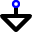
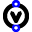
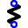
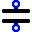
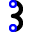
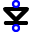
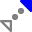
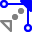
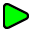

[← AI Reference](README.md)

# LTspice Keyboard Shortcuts Reference

*Last updated: 2026-05-14*  
*LTspice version: 24+*

Complete keyboard shortcuts for Windows. Based on the official LTspice keyboard shortcut cheat sheet.

**Official cheat sheet (PDF):** [standard](https://www.analog.com/media/en/news-marketing-collateral/solutions-bulletins-brochures/ltspice-keyboard-shortcuts.pdf) · [ink saver](https://www.analog.com/media/en/news-marketing-collateral/solutions-bulletins-brochures/ltspice-keyboard-shortcuts-ink-saver.pdf) (print-friendly)

---

## Place Components

| Icon | Shortcut | Action |
|------|----------|--------|
|  | W | Wire |
|  | G | Ground |
|  | Alt+G | Com |
|  | V | Voltage source |
|  | R | Resistor |
|  | C | Capacitor |
|  | L | Inductor |
|  | D | Diode |
|  | P | Component (opens component dialog) |
|  | N | Label net |
|  | T | Text/comment |
|  | . | SPICE directive (right-click text field to open "Help me Edit" dialog) |
|  | B | Bus tap |
|  | Shift+left-click | Toggle directive/comment |

*Press Esc or right-click to exit mode.*

---

## General Editing

| Icon | Shortcut | Action |
|------|----------|--------|
|  | Ctrl+X | Delete |
|  | Del | Delete |
|  | Backspace | Delete |
|  | Ctrl+C | Copy/duplicate* |
|  | M | Move* (select components to move) |
|  | S | Stretch* (select anchor points to move) |
|  | Ctrl+R | Rotate |
|  | Ctrl+E | Mirror |
|  | Z | **Schematic:** zoom area (drag over area), zoom in (click on scheme) **Waveform:** zoom area is default mode |
|  | Shift+Z | Zoom out |
|  | Space | Zoom to fit, zoom extents |
|  | Ctrl+G | Toggle grid |
|  | Ctrl+Z | Undo |
|  | Ctrl+Shift+Z | Redo |

*Choose mode first, then select component or waveform title.*  
*Press Esc or right-click to exit mode.*

---

## Waveform Viewing

Mouse actions are on label of waveform trace.

| Shortcut | Action |
|----------|--------|
| click or C | Add cursor and see measure |
| L | Label current cursor position |
| Shift+C or Esc | Clear all cursors |
| Alt+click | Highlight corresponding net in schematic |
| Ctrl+click | Integrate |
| drag | Move trace (to another pane) |
| drag, hold Ctrl | Copy trace (to another pane) |
| A | Add trace |
| P | Add pane above |
| B | Add pane below |
| U | Move active pane up |
| D | Move active pane down |
| Shift+S | Select steps |

*Click in waveform pane to apply keyboard functions to active frame.*

---

## Waveform Pan & Cursor

### No Cursors

| Shortcut | Action |
|----------|--------|
| ← → ↑ ↓ | Navigate |

### Cursor Present

| Shortcut | Action |
|----------|--------|
| ← → | Snap cursor to next time data point |
| ↑ ↓ | Cycle cursors through traces at current time data point |
| Shift+← → | Snap cursor to next data point *Zoom-in ~50% when no cursors* |
| Ctrl or Shift+← → | Bump cursor 10 data points |
| Ctrl+Shift+← → | Bump cursor 100 data points |

### Mouse Panning

| Shortcut | Action |
|----------|--------|
| Ctrl | Pan with mouse |
| Ctrl+Shift | Pan left and right with mouse |
| Ctrl+Alt | Pan up and down with mouse |

---

## Schematic Options

| Shortcut | Action |
|----------|--------|
| hold Ctrl | Place angled wires |
| hold Ctrl | Draw shapes off grid |
| Ctrl+Shift+Alt+U | Show hidden text (e.g., parallel or series resistance) |
| Ctrl+U | Show/hide unconnected marks |
| Ctrl+A | Show/hide text anchor marks |

*Most options available in Settings.*

---

## Probe Schematic

*Probes available once simulation is running.*

| Icon | Shortcut | Action | What it Does |
|------|----------|--------|--------------|
|  | click | **Probe Wire** | Plot voltage |
|  | click | **Probe Component** | Plot current |
|  | Alt+click | **Probe Wire** | Plot current |
|  | Alt+click | **Probe Component** | Plot instantaneous power |
|  | drag net-to-net | | Plot differential voltage |

---

## Edit Text & Component Parameters

| Action | Text | Component Body |
|--------|------|----------------|
| right-click → | Edit with helper if available | Edit limited parameters |
| Ctrl | Edit directly | Edit all parameters |

*Text preceded by an underscore, e.g., "_FAULT" is displayed with an overbar, "FAULT".*

---

## Simulator

| Icon | Shortcut | Action |
|------|----------|--------|
|  | A | Configure analysis |
|  | Alt+R | Run/pause |
|  | Alt+S | Stop |
|  | Ctrl+L | View SPICE log |
|  | 0 | Reset sim waveform T = 0 |

*Schematics can be edited even as a simulation runs.*  
*Edits affect subsequent simulations.*

---

## Notes

- **Customization**: Keyboard shortcuts can be customized via Help > Keyboard Shortcut Cheat Sheet > Edit Keyboard Shortcuts
- **Platform**: This reference is for Windows v24+ and Mac v26+
- **Version-specific**: Shortcuts may vary between LTspice versions
- **Exit modes**: Press Esc or right-click to exit most editing modes
- **Context-sensitive**: Some shortcuts only work in specific contexts (schematic vs. waveform viewer)

---

## Related Documentation

- [LTSPICE-MENU-REFERENCE.md](LTSPICE-MENU-REFERENCE.md) — Complete menu hierarchy and shortcuts
- [LTSPICE-QUICKSTART.md](LTSPICE-QUICKSTART.md) — Getting started guide
- [WAVEFORM-VIEWER-GUIDE.md](WAVEFORM-VIEWER-GUIDE.md) — Detailed waveform viewer documentation
  

---

*Documentation source: [github.com/analogdevicesinc/ltspice-reference](https://github.com/analogdevicesinc/ltspice-reference)*

